# Bonobo-Bepuphysics2-Demos

Test bed for the `Bonobo.Bepuphysics2` NuGet package (1.0.0) and for Bonobo engine compatibility.

Upstream BepuPhysics2 demos (vendored sources in `Temp/`) are ported into AOT-safe Bonobo.ECS
simulations and rendered by a Babylon.js v9 page through a zero-copy, pure-64-bit pinned
signal bridge — the same ABI the Bonobo engine uses (`Float64Array` over a WebView2 shared
buffer on this host). A WinUI 3 + WebView2 + Native AOT host runs the simulations in-process.

This repo is a **test harness**, not a game: every demo is a fixture that exercises the physics
library, the ECS mapping and the host bridge.

## Layout

| Path | What |
| --- | --- |
| `src/DemoEngine` | Self-contained mirror of the Bonobo engine ABI: pinned buffers, signal header/layout, fixed-step host loop, input ring, module registry |
| `src/Game.BepuDemos` | Ported demos (`Bonobo.Bepuphysics2` + `Bonobo.ECS` / `Bonobo.ECS.SourceGenerators`) |
| `src/DemoHost.WinApp` | WinUI 3 + WebView2 + Native AOT host (only host target) |
| `src/BepuDemos.UI` | Babylon.js v9 frontend: main menu (30-demo grid), demo scenes, zero-copy decoders |
| `src/Game.BepuDemos.Tests` | xUnit v3 unit/determinism/layout tests |
| `src/Game.BepuDemos.Tests.Aot` | TUnit AOT/trim pattern checks |
| `src/Game.Tests.UI` | Playwright E2E over CDP (WebView2) with screenshots |
| `docs/compat-review.md` | Per-demo compatibility review (authoritative sim vs client render-only) |
| `docs/ai-agents/codebase-truth.md` | Verified repo facts for agent sessions (commands, port recipe, API gotchas) |
| `docs/screenshots/` | Committed E2E screenshots for human review |
| `Temp/` | Upstream BepuPhysics2 demo sources (not part of the build) |

## Build and run

```powershell
npm ci                                   # frontend dependencies (workspace: bepu-demos-ui)
npm run build                            # Vite bundle -> src/BepuDemos.UI/wwwroot/dist
dotnet build bonoboBepuDemos.slnx

# Tests (MTP runners; `dotnet test` reports "Zero tests ran" on this SDK — see
# docs/compat-review.md §5.3, run the apps directly):
dotnet run --project src/Game.BepuDemos.Tests        # xUnit v3: ABI pins + demo behavior
dotnet run --project src/Game.BepuDemos.Tests.Aot    # TUnit: AOT/trim pattern checks

# Desktop host (Release, Native AOT, unpackaged):
dotnet publish src/DemoHost.WinApp/DemoHost.WinApp.csproj -c Release -r win-x64 -p:Platform=x64
# → src/DemoHost.WinApp/bin/x64/Release/net10.0-windows10.0.26100.0/win-x64/publish/DemoHost.WinApp.exe
```

E2E (Playwright over the WebView2 CDP endpoint; writes `docs/screenshots/<demo>.png`):

```powershell
npm --prefix src/Game.Tests.UI install
npm run test:e2e
```

## Demo scenes

The app boots into the **main menu** (`menu`): a 30-card grid of the upstream DemoSet in
`docs/compat-review.md` order. All thirty demos are live cards (the full corpus is ported).
Every demo scene has a `Menu` back button; switching scenes disposes the Babylon scene and
releases the C# simulation + its pinned signal buffer.

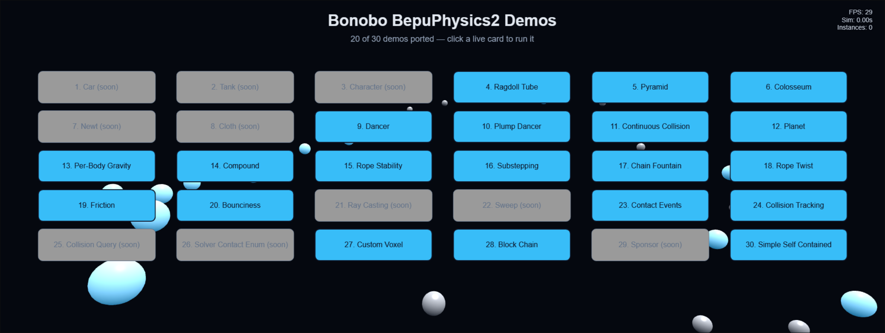

| Scene key | Upstream demo | Notes |
| --- | --- | --- |
| `menu` | — | 30-demo card grid; host stays idle (`menu` is an unknown sim key) |
| `simple-self-contained` | SimpleSelfContainedDemo | sphere on a static floor + ECS orbit markers, tap-to-fire |
| `pyramid` | PyramidDemo | 12 box pyramids (upstream 40), click cannonball |
| `bounciness` | BouncinessDemo | 40×40 material sweep (upstream 100×100), 8 substeps |
| `planet` | PlanetDemo | inverse-square gravity, 24×8×24 orbiting sheet (upstream 40×20×40) |
| `friction` | FrictionDemo | 100 boxes, friction sweep 0 → 0.75, colour-banded |
| `per-body-gravity` | PerBodyGravityDemo | 20×4×20 grid (upstream 20×20×20), per-body gravity by shape |
| `colosseum` | ColosseumDemo | 3 ring layers (upstream 6), click bullets + `Shoot Big` |
| `continuous-collision-detection` | ContinuousCollisionDetectionDemo | discrete/passive/continuous grids + hinge/motor spinner pairs |
| `substepping` | SubsteppingDemo | 10000:1 rope + capstone stack + motorized chains, `Substeps±`/`Iters±` |
| `compound` | CompoundDemo | compound children as individual records + `BigCompound` 128-child bodies |
| `contact-events` | ContactEventsDemo | full 8-event handler layer, particles on contact add (`Drop`) |
| `collision-tracking` | CollisionTrackingDemo | deferred pair analysis, particles on new touching ids (`Drop`) |
| `custom-voxel-collidable` | CustomVoxelCollidableDemo | 20×15×20 voxel terrain (upstream 40×30×40) + 1600 boxes |
| `rope-stability` | RopeStabilityDemo | 7 rope configs + skip-constraint rope, static wrap post |
| `rope-twist` | RopeTwistDemo | 2×65-link ropes (upstream 4×131) on a spinning 10000-mass ball, 30 substeps (upstream 60) |
| `chain-fountain` | ChainFountainDemo | 2048 capsule beads (upstream 4096) launching out of the container |
| `block-chain` | BlockChainDemo | 20×20 ball-socket chains, `ICO` verb = upstream Z key (coins) |
| `ragdoll-tube` | RagdollTubeDemo | 4×4×11 ragdolls (upstream 4×4×44) in a 12-panel spinning tube (upstream 20) |
| `dancer` | DancerDemo | 64 dancers 8×8 (upstream 256), cloth dresses LOD-clamped, sequential solves |
| `plump-dancer` | PlumpDancerDemo | 16 dancers 4×4 (upstream 64), weld/voxel fat suits LOD-clamped |
| `ray-casting` | RayCastingDemo | 16384 rays × 3 sources (random/frustum/wall) as colored `LineState` segments, `Cycle`/`Rotate`/source buttons |
| `sweep` | SweepDemo | 16 rotating scene-wide sweeps + 20-pose ghost trails + impact tangent lines |
| `collision-query` | CollisionQueryDemo | 5×5 shape queries through a `CollisionBatcher`, green/red touched routing |
| `solver-contact-enumeration` | SolverContactEnumerationDemo | solver contact extraction on a sensor box, impulse-scaled contact cylinders |
| `car` | CarDemo | player car (WASD/Shift/Space) + 64 AI cars on a quarter-circle track, 129×129×6 terrain |
| `tank` | TankDemo | player tank (WASD/IJKL/Space/Shift/B) + 32 AI tanks duelling with CCD projectiles |
| `newt` | NewtDemo | 8 voxel-tetrahedralized newts (1 824 nodes each) welded + volume-constrained, heavy ball drop, OBJ ghost |
| `character` | CharacterDemo | full dynamic character controller (custom constraints) over legos/fans/tongue/seesaw/platforms + 15× newt |
| `sponsor` | SponsorDemo | hopping sponsor newts chasing 150 AI characters through huts, 27 sponsor PNG billboards, 60× overlord newt |
| `cloth` | ClothDemo | 4 hanging 10×30 curtains + a 48×48 sheet, vertex-level records rebuilt into client `VertexData` meshes |

Per-demo status and every deliberate deviation live in `docs/compat-review.md`.

## Demo gallery

Every demo below is captured by the Playwright E2E suite (`npm run test:e2e`), which asserts
the scene's `window.__<camelKey>()` readout and then writes the screenshot to
`docs/screenshots/<game-key>.png`. Entries are in the order the menu presents them (upstream
`DemoSet` order, 29 demos plus `SimpleSelfContained`).

Each entry has the same three-layer technical readout:

- **Physics (BepuPhysics2)** — the upstream fixture and the Bepu API it exercises (shapes,
  constraints, callbacks, solver settings, queries), plus the ported fixture size where the
  upstream constants were reduced.
- **ECS (Bonobo.ECS)** — how Bepu state becomes entities and render records: the demo creates a
  `World`, bodies become entities carrying a `PhysicsBody` handle plus mirrored
  `Position3`/`Rotation3`/`Scale3` components, and after every null-`ThreadDispatcher`
  `Simulation.Timestep(dt)` the authoritative poses are copied into those components and emitted
  as one batched stride-12 transform signal (`DemoPoseSet` is the shared render-id registry).
  Ranges are stable and documented per demo; the client routes records by id range, never by
  arrival order.
- **Render (Babylon.js v9)** — unit meshes driven by thin instances and routed by render-id
  range (`createShapeSet`), the capsule contract (one baked mesh per `(radius, length)` pair,
  records emit scale 1) or the special paths (`LineSet` for debug lines, rebuildable `VertexData`
  for cloth and OBJ ghosts), plus camera/GUI.

### Demo Machine

Consumer machine with no dedicated GPU a virtual machine open and 2 instances of opencode runing at same time: Fixed 100 FPS on AMD Ryzen 7 5800H using its integrated Radeon Vega 8 graphics (with 4GB allocated VRAM)

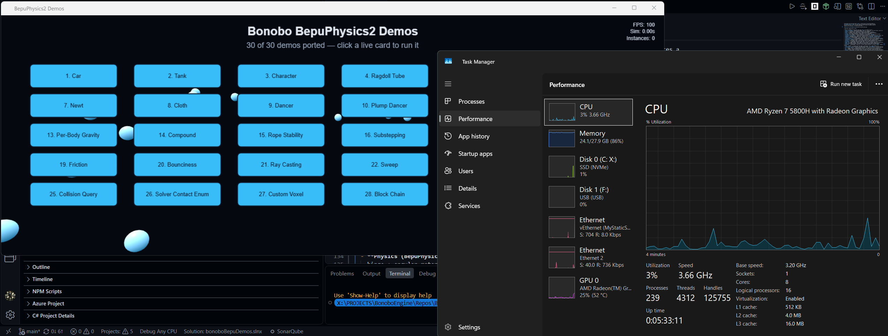

### 1. Car (`car`)

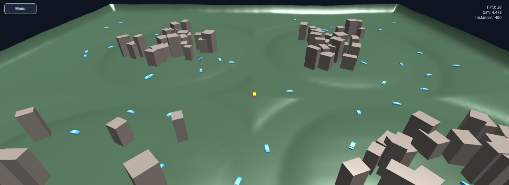

A player car plus 64 AI cars race over a quarter-circle track laid on a deformed terrain.

- **Physics (BepuPhysics2):** compound car bodies (body box + cabin) with four wheels driven by
  hinge + angular-motor suspension and Ackerman steering (`SimpleCarController`), tuned per car
  through a `CollidableProperty<CarBodyProperties>`; AI cars follow lane offsets along the
  `RaceTrack`. Upstream 384 AI cars are reduced to 64 and the heightfield from 257×257×3 to
  129×129×6 (same world extent); the deformer formula is duplicated client-side. Every solve is
  a null-`ThreadDispatcher` `Simulation.Timestep(dt)`.
- **ECS (Bonobo.ECS):** render ids `100 + carIndex·8 + child` (carIndex 0 = player; child 0 body,
  1 cabin, 2–5 wheels) and `100000+` static landmark buildings are registered in the shared
  `DemoPoseSet`, so each body is an entity with `PhysicsBody` + mirrored pose components. Player
  intent arrives as `VehicleControl` ring packets (id 5) and is applied to target throttle,
  steering and brake.
- **Render (Babylon.js v9):** thin-instance shape sets for car bodies, cabins, wheels (unit
  cylinders scaled to `(diameter, width, diameter)`) and buildings; the terrain is a
  presentation-only `createDeformedPlane` duplicate of the simulation's heightfield; the shared
  `ArcRotateCamera` target follows the player car.

### 2. Tank (`tank`)

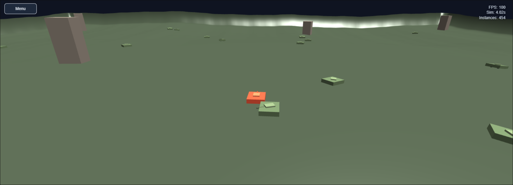

A player tank plus 32 AI tanks duel with CCD projectiles on a flattened-center heightfield.

- **Physics (BepuPhysics2):** body/turret/barrel compound parts, two five-wheel treads with
  suspension servos and twist-servo turret aiming; per-tank state lives in a
  `CollidableProperty<TankDemoBodyProperties>`. AI tanks aim and fire; projectiles use explicit
  continuous detection; destroyed tanks fall apart physically (explosion visuals are dropped).
  Null-dispatcher solves; upstream 100 AI tanks → 32 and the 257×257×3 terrain →
  129×129×6.
- **ECS (Bonobo.ECS):** render ids `1000 + tankIndex·16 + child` (body, turret, barrel, ten
  wheels), `100000+` landmark buildings and `200000+` live projectiles; projectiles enter and
  leave through the `Spawned`/removed lifecycle path. Player control arrives as `TankControl`
  ring packets (id 6, WASD/IJKL/Space/Shift/B).
- **Render (Babylon.js v9):** shape sets for body parts, wheels, buildings and yellow projectile
  spheres; the terrain is a client-side deformed-plane duplicate; the camera target follows the
  player tank.

### 3. Character (`character`)

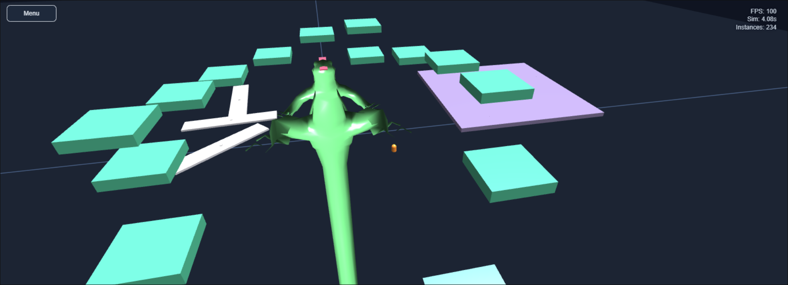

A dynamic capsule character walks over legos, spinning fans, a tongue, a seesaw, moving
platforms and a giant static newt.

- **Physics (BepuPhysics2):** full `Characters/` port — `CharacterControllers` registers
  demo-side `StaticCharacterMotionConstraint`/`DynamicCharacterMotionConstraint` into the solver
  (`Solver.Register<T>`, batch type ids 50/51) and hooks `BeforeCollisionDetection` /
  `CollisionsDetected`. The capsule never sleeps (negative deactivation threshold) so a
  one-step-delayed input packet cannot be swallowed by a sleep transition, and moving platforms
  are kinematic bodies driven by velocity servos.
- **ECS (Bonobo.ECS):** `CharacterMove` ring packets (id 4) carry the camera-relative goal
  direction computed client-side. Render ids: `0` floor, `1` static newt, `2` character capsule,
  `1000+` legos, `10000+` fan bases/blades, `20000` tongue, `20100+` seesaw,
  `30000+` moving platforms, `40000+` static box field.
- **Render (Babylon.js v9):** a baked capsule mesh (height 2, radius 0.5) for the character,
  box sets for the scene, and the client-loaded `newt.obj` at scale 15 for the static newt; the
  camera target follows the capsule.

### 4. Ragdoll Tube (`ragdoll-tube`)

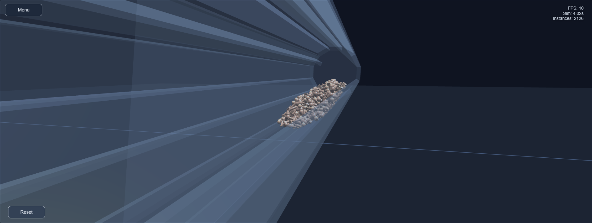

176 subgroup-filtered capsule ragdolls tumble inside a spinning 12-panel kinematic tube.

- **Physics (BepuPhysics2):** `RagdollBuilder` assembles each 16-body ragdoll from capsules
  (hips, abdomen, chest, head, three-joint arms and legs); `SubgroupCollisionFilter` +
  `SubgroupFilteredCallbacks` disable intra-ragdoll contacts while keeping inter-ragdoll
  contacts; the tube is a kinematic `BigCompound` of 12 panels plus a spine, spun at
  0.25 rad/s; `SolveDescription(4, 1)`.
- **ECS (Bonobo.ECS):** render ids `0` ground, `10+` tube children (one parent ∘ local box record
  per panel, the shared compound-child convention) and `100 + ragdoll·16` for the ragdoll
  bodies; every body pose is mirrored through `DemoPoseSet` after each step.
- **Render (Babylon.js v9):** box sets for the tube shell and limbs, sphere set for heads; a
  `Reset` command button.

### 5. Pyramid (`pyramid`)

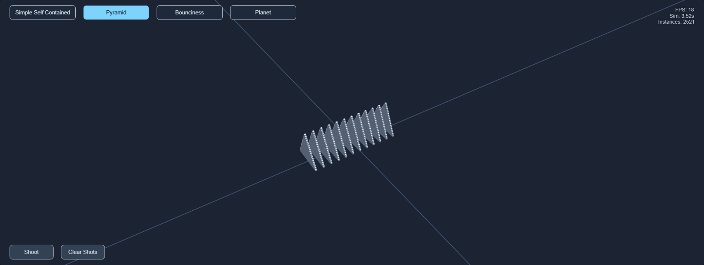

Twelve box pyramids and a click-launched sphere cannonball with a random radius (0.5–5.5).

- **Physics (BepuPhysics2):** 20-row, 210-box stacks of `Box(1,1,1)` dynamic bodies; the click
  path spawns spheres at 150 m/s with mass 1 from the demo's seeded `Random(5)` (matching the
  upstream Z-key cannonball); the payload-free `shoot` / `clear-projectiles` verbs drive the GUI.
  Upstream 40 pyramids are reduced to 12.
- **ECS (Bonobo.ECS):** render ids `0` floor, `100+` pyramid boxes, `10000+` projectiles;
  fire-ball ring packets (id 2) route through `IFireBallSink` into the active simulation.
- **Render (Babylon.js v9):** unit box and sphere shape sets; the floor is a single unit box
  scaled ×2500; GUI `Shoot` / `Clear Shots` buttons.

### 6. Colosseum (`colosseum`)

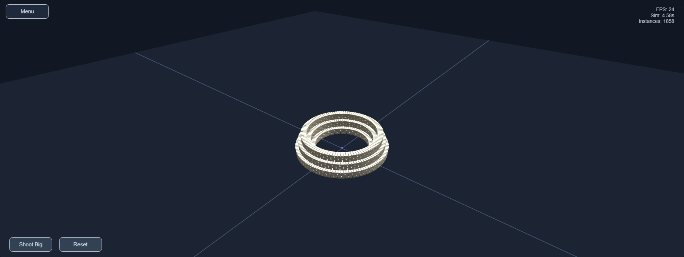

Concentric ring walls and platforms stack into a colosseum, hit by purple hail and "super shootie
patootie" spheres.

- **Physics (BepuPhysics2):** rings of `Box(0.5, 1, 3)` bodies stacked in circular patterns;
  bullets are 400 m/s, 0.5 m spheres and big shots are 3 m, 100 kg spheres. Upstream 6 layers →
  3 (≈1857 boxes vs ≈5000); the click/tap fire-ball path plus the `shoot-big` verb replace the
  upstream Z/X keys.
- **ECS (Bonobo.ECS):** render ids `0` ground, `100+` ring boxes, `100000+` bullets, `200000+`
  big shots; each projectile is a short-lived transform record.
- **Render (Babylon.js v9):** a box set for the rings and two sphere sets (orange bullets, purple
  big shots); `Shoot Big` / `Reset` buttons.

### 7. Newt (`newt`)

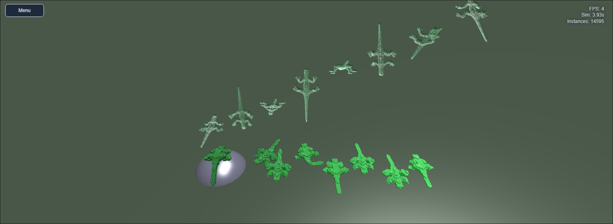

Eight squishy newts built from a voxel-tetrahedralized OBJ, welded with springy constraints,
with a heavy ball dropped on them.

- **Physics (BepuPhysics2):** the embedded `newt.obj` is parsed by the in-repo span parser
  (`ObjMeshParser`, no `ObjLoader` package) and voxel-tetrahedralized deterministically
  (`NewtTetrahedralizer`, ≈1824 bodies per newt). Nodes are connected by springy `Weld`
  constraints plus `VolumeConstraint` tetrahedra; `DeformableCollisionFilter` strips collidables
  from interior vertices; a heavy ball and a static sphere bump complete the fixture.
- **ECS (Bonobo.ECS):** render ids `0` floor, `1` heavy ball, `2` static sphere, and
  `100000 + newtIndex·4096 + vertexIndex` for every deformable node; the registry mirrors the
  whole node lattice each step.
- **Render (Babylon.js v9):** per-newt 6-segment sphere shape sets for the nodes, plus a
  translucent wireframe ghost cloned from the same `newt.obj` the C# side embeds; floor and ball
  ride thin instances.

### 8. Cloth (`cloth`)

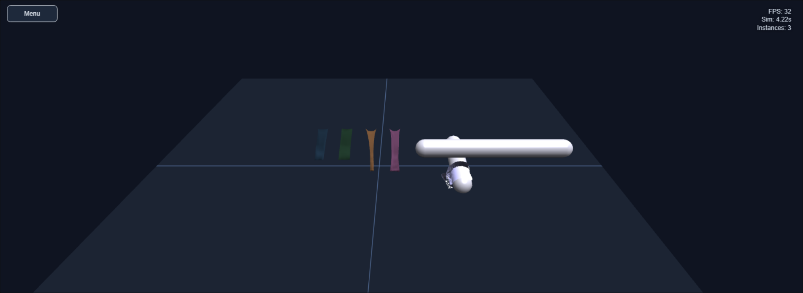

Four hanging curtain lattices and a 48×48 fully dynamic sheet drape over static capsule bars.

- **Physics (BepuPhysics2):** sphere-node lattices linked by distance constraints with stiff
  (20,1) and soft (5,1) spring settings, with or without area constraints; the top corners are
  pinned to kinematic bodies. `ClothCallbacks` + `ClothCollisionFilter` handle self- and
  inter-panel contacts; the sheet is reduced from 96×96 (the full lattice would be 4× larger
  than every other ported constraint demo combined).
- **ECS (Bonobo.ECS):** cloth vertices re-use the `Transform3DState` stride instead of a
  demo-specific record — id = `10000 + panel·4096 + row·width + column`, quaternion unused,
  scale = node diameter (design note in `docs/compat-review.md` §6); ids `0` floor, `1..2`
  capsule bars.
- **Render (Babylon.js v9):** one updatable grid `VertexData` mesh per panel; positions and
  recomputed normals (`VertexData.ComputeNormals`) are rewritten every dispatch. The static bars
  are baked capsule meshes (`capsuleHeight` 136 and 76, radius 8) per the capsule contract.

### 9. Dancer (`dancer`)

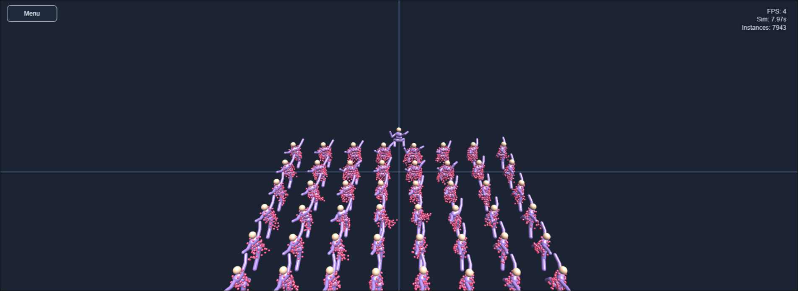

A servo-driven main dancer plus 64 background dancers wearing cloth dresses.

- **Physics (BepuPhysics2):** the main dancer is driven by `DancerControl` servos; each background
  dancer owns a cosmetic `Simulation.Create` (cloth dress = sphere nodes + `CenterDistanceLimit`
  constraints) that steps **sequentially** instead of the upstream `ParallelLooper` so the whole
  ported set stays bit-deterministic. Dress LOD is clamped to [1, 1.5] (~15×15 nodes vs upstream
  29×29); upstream 16×16 → 8×8 dancers.
- **ECS (Bonobo.ECS):** one shared `World` with one pose registry per simulation (main + one per
  dancer). Render ids `0` floor, `100+slot` main-dancer bodies (12), and
  `1000 + dancerIndex·512` background bodies followed by the dress nodes — the stride is 512
  because the dress node count varies with LOD, hence a coarser per-dancer block than the suit
  demo.
- **Render (Babylon.js v9):** shared scene factory (`scenes/dancers/dancerSceneShared.ts`):
  skeleton capsules baked per `(radius, length)` kind, a sphere set for heads and one node-sphere
  set for dresses; the mesh sets are named `demo-*` so the stats overlay counts them.

### 10. Plump Dancer (`plump-dancer`)


The dancer infrastructure plus a voxel fat suit welded to the capsule skeleton.

- **Physics (BepuPhysics2):** a lattice of sphere bodies is welded to the dancer's capsules with
  `Weld` constraints, and interior nodes are stripped of collidables (a default
  `CollidableDescription` means "no collidable"). Suit LOD is clamped to [1, 1.4] (≈12³ nodes vs
  upstream 23³); upstream 8×8 → 4×4 dancers with sequential solves.
- **ECS (Bonobo.ECS):** the same layout as `dancer` but with a `4096` render-id stride for the
  larger suit lattice: `0` floor, `100+slot` main dancer, `1000 + dancerIndex·4096` background
  bodies followed by suit nodes.
- **Render (Babylon.js v9):** the shared dancer factory with a different attachment color and
  capacity; suit nodes are unit spheres scaled by the record.

### 11. Continuous Collision (`continuous-collision-detection`)

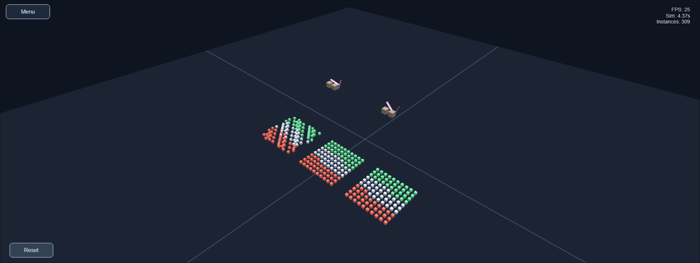

Three grids of boxes falling at 150 m/s compare discrete, passive and continuous collision
detection; spinner pairs add angular CCD.

- **Physics (BepuPhysics2):** `ContinuousDetection.Discrete` tunnels, `Passive` uses unlimited
  speculative margins and `Continuous(min, conv)` uses explicit sweeps; all three grids fall the
  same way so the difference is visible. Spinner pairs are hinge + angular-motor blades on
  one-body linear servos; the oscillation is driven from the fixed-step clock (a deterministic
  replacement for the upstream mouse aim).
- **ECS (Bonobo.ECS):** render ids `0` ground, `100..399` for the three 10×10 box grids, `1000+`
  spinner bases and blades; all poses flow through the shared registry.
- **Render (Babylon.js v9):** three color-coded box sets (red discrete, pale passive, green
  continuous) plus spinner base/blade sets; a `Reset` button.

### 12. Planet (`planet`)

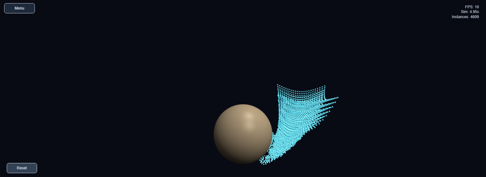

Inverse-square gravity pulls a sheet of 4608 orbiting spheres toward a planet center.

- **Physics (BepuPhysics2):** a custom `IPoseIntegratorCallbacks` (`PlanetaryGravityCallbacks`)
  integrates velocity toward the center with a `1/d²` falloff clamped at one unit; the sheet is
  launched at 30 u/s and either orbits or re-enters. Upstream 40×20×40 → 24×8×24 spheres.
- **ECS (Bonobo.ECS):** render ids `0` planet, `100+` orbiting spheres, mirrored through the
  demo's own render-id→entity dictionary; `Reset` re-runs the launch.
- **Render (Babylon.js v9):** two sphere shape sets (baked planet sphere, ball spheres); a
  `Reset` button.

### 13. Per-Body Gravity (`per-body-gravity`)

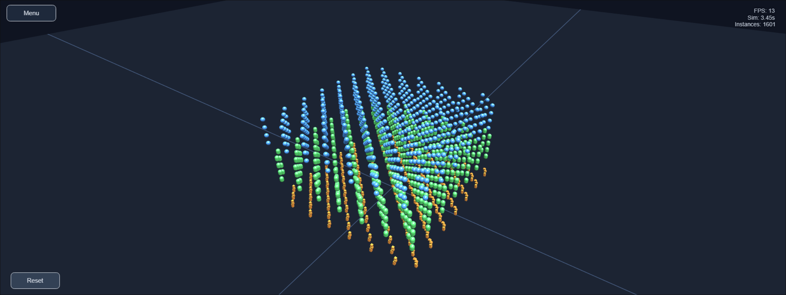

Per-body gravity keyed by shape: spheres fall slowly, capsules in between, boxes quickly.

- **Physics (BepuPhysics2):** `IPoseIntegratorCallbacks.IntegrateVelocity` gathers one
  `CollidableProperty<float>` value per SIMD lane (body handle lookup through
  `Bodies.ActiveSet.IndexToHandle`) and adds it to `velocity.Linear.Y`; the value cycles
  `(i + k) % 3` so each column mixes shapes (sphere −0.1, capsule −3, box −10). Upstream
  20×20×20 → 20×4×20 = 1600 bodies.
- **ECS (Bonobo.ECS):** render ids `0` floor, `100+` bodies; the shape kind is encoded in the
  render-id routing on the client and in the fixture's `ShapeKind*` constants.
- **Render (Babylon.js v9):** three shape sets (blue spheres, green capsules baked per
  `(radius, length)`, orange boxes); a `Reset` button.

### 14. Compound (`compound`)

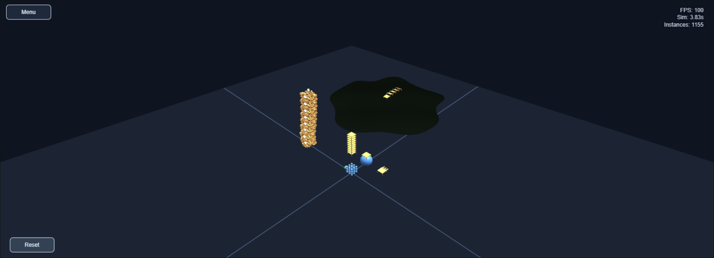

`Compound` versus `BigCompound` (128-child, tree-accelerated), built through `CompoundBuilder`.

- **Physics (BepuPhysics2):** a capsule+box compound, four 3×3 sphere-grid compounds, a 17-table
  stack family, a clamp-shaped compound, eight 128-child `BigCompound`s (including the
  recentering overload) and a deformed static mesh. `Compound` skips the acceleration structure
  for few children while `BigCompound` builds a tree for many.
- **ECS (Bonobo.ECS):** every compound child is emitted as its own record — parent Bepu pose ∘
  child local pose — so no new signal type is needed. Ids `0` ground, `10` static sphere,
  `20` deformed plane, `1000+` sphere children, `2000+` capsule children, `3000+` box children;
  the signal buffer is fixed at 4096 records.
- **Render (Babylon.js v9):** one shape set per child kind; the deformed plane is rebuilt
  client-side from the same formula (presentation only); a `Reset` button.

### 15. Rope Stability (`rope-stability`)

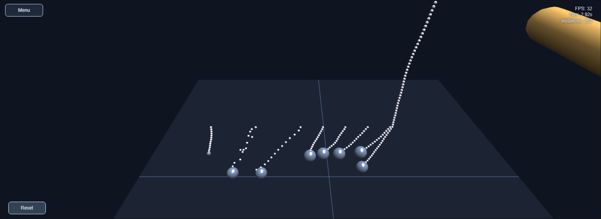

Seven rope stability configurations and a 100-link skip-constraint rope swing next to a static
wrap post.

- **Physics (BepuPhysics2):** the configurations pit naive light and heavy wrecking balls against
  softer springs, a mass boost, an inertia boost, a zero lever arm and a direct cheat constraint;
  each configuration is 12 dynamic links plus a wrecking ball. The skip rope is 100 links with 4
  skip constraints per body (shortcuts reach four links ahead); the wrap post is a static
  capsule. This is a full-fidelity port — only the `reset` verb was added.
- **ECS (Bonobo.ECS):** render ids `0` ground, `100 + config·20` rope links, `300+` skip-rope
  links, `500+` wrecking balls, `600` wrap post.
- **Render (Babylon.js v9):** sphere sets for links/balls and a baked capsule for the wrap post
  (`capsuleHeight`/`capsuleRadius`, record scale 1); a `Reset` button.

### 16. Substepping (`substepping`)

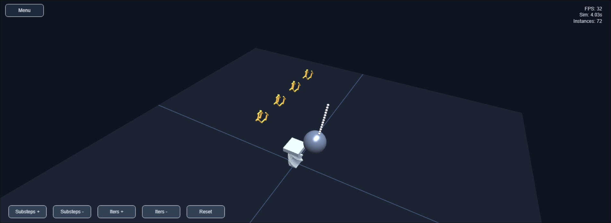

Substepping stabilizes extreme mass ratios and long constraint sequences at low cost.

- **Physics (BepuPhysics2):** the demo starts at `SolveDescription(2, 48)` and exposes
  `Solver.SubstepCount` / `VelocityIterationCount` through the `substeps-more|less` and
  `iters-more|less` verbs, waking all bodies after each change. The fixture is a 10000:1 rope and
  wrecking ball, a 20-box stack with a 10000-mass capstone, and four motorized hinge chains;
  contacts use soft springs (640, 480) with unlimited recovery.
- **ECS (Bonobo.ECS):** render ids `0` ground, `100+` rope links, `200` wrecking ball, `300+`
  stack boxes, `400` capstone, `500+` chain links (9 per chain).
- **Render (Babylon.js v9):** sphere and box shape sets; the GUI exposes Substeps ± / Iters ± /
  Reset, and the stats overlay shows the live sim clock.

### 17. Chain Fountain (`chain-fountain`)

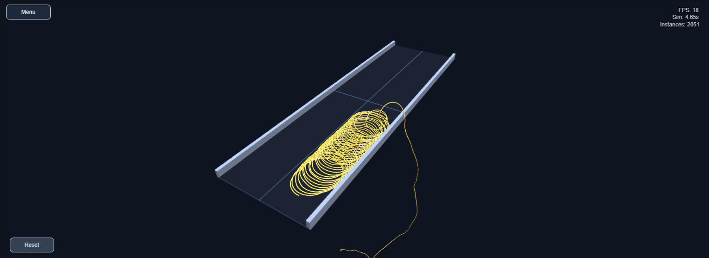

Newton's beads: 2048 capsule beads coil in a container, then yank themselves over the lip.

- **Physics (BepuPhysics2):** per-link `BallSocket` constraints plus swing limits produce the
  Mould effect; `RopeFilter` + `RopeNarrowPhaseCallbacks` keep the chain from self-colliding;
  `SolveDescription(1, 12)` runs a stiff (240, 0) contact spring, and the first 32 beads get an
  initial 20 u/s kick. Upstream 4096 → 2048 beads.
- **ECS (Bonobo.ECS):** render ids `0` container floor, `10+` container walls, `100+` beads; the
  shared registry syncs every bead each step.
- **Render (Babylon.js v9):** a capsule shape set for beads (baked radius 0.05, record scale 1)
  and a box set for the container; a `Reset` button.

### 18. Rope Twist (`rope-twist`)

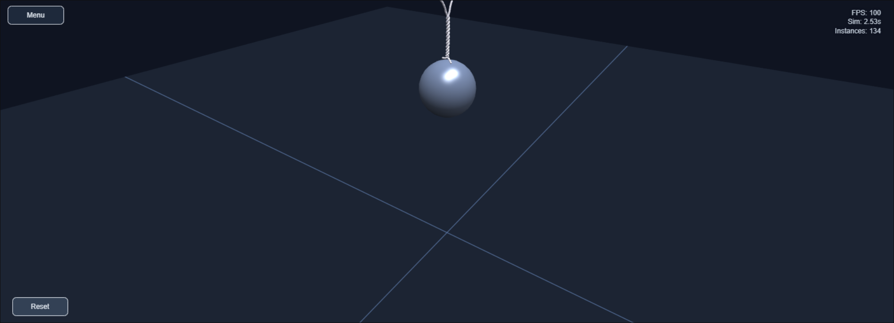

Two ropes tied to a 10000-mass wrecking ball spinning around Y stress the worst-case mass ratio.

- **Physics (BepuPhysics2):** zero-friction (hard) contacts, a very stiff spring (1200, 1) and 30
  substeps (`SolveDescription(1, 30)`, upstream 60) keep the ratio stable; `RopeFilter` prevents
  rope self-collision. Upstream 4 ropes × 131 links → 2 ropes × 65 links.
- **ECS (Bonobo.ECS):** render ids `0` ground, `100 + rope·100` rope links (65 per rope),
  `500` ball.
- **Render (Babylon.js v9):** sphere sets for links and the ball; a `Reset` button.

### 19. Friction (`friction`)

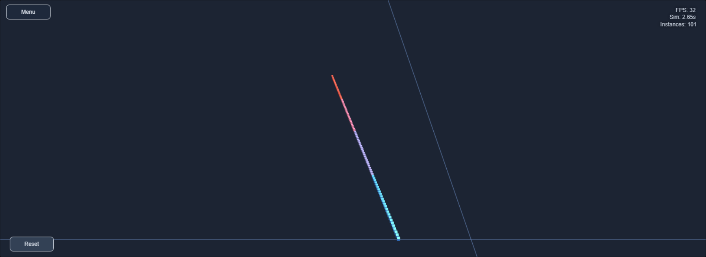

One hundred boxes slide sideways; the friction coefficient ramps 0 → 0.75 so they stop at
different distances.

- **Physics (BepuPhysics2):** per-collidable materials through
  `CollidableProperty<SimpleMaterial>`; the narrow phase blends friction multiplicatively and
  picks the spring of the collidable with the higher maximum recovery velocity. Boxes start at
  20 u/s on a 30-thick, 2500-wide floor.
- **ECS (Bonobo.ECS):** render ids `0` floor, `100+` boxes.
- **Render (Babylon.js v9):** four client-side color bands (blue → red) selected by box index so
  the friction gradient is visible; the scene readout reports the mean final X; a `Reset` button.

### 20. Bounciness (`bounciness`)

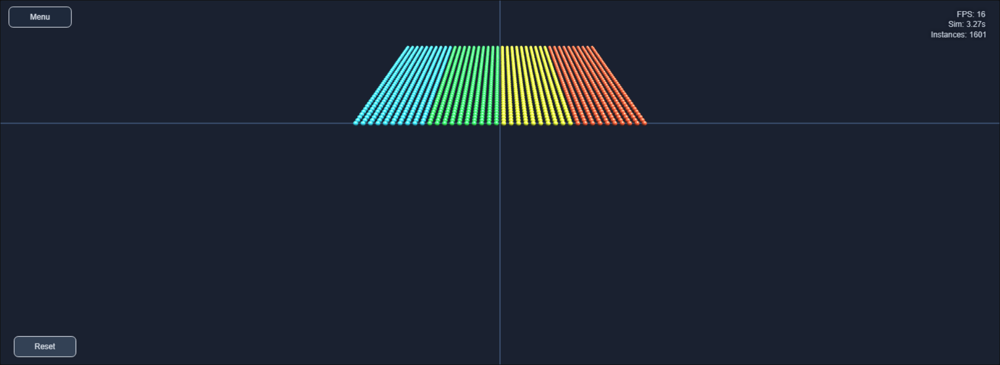

Contact springs instead of a restitution coefficient: frequency increases left → right, damping
ratio far → near.

- **Physics (BepuPhysics2):** the same `SimpleMaterial`/`CollidableProperty<T>` pattern as
  Friction — Bepu has no restitution, so the bounce is the contact spring's response. Per-column
  spring frequency and per-row damping ratio define the sweep. Upstream 100×100 → 40×40 = 1600
  spheres dropped onto a 1250-half-extent floor.
- **ECS (Bonobo.ECS):** render ids `0` floor, `100+` spheres; `reset` re-runs the drop.
- **Render (Babylon.js v9):** a sphere shape set and one scaled unit-box floor; a `Reset` button.

### 21. Ray Casting (`ray-casting`)

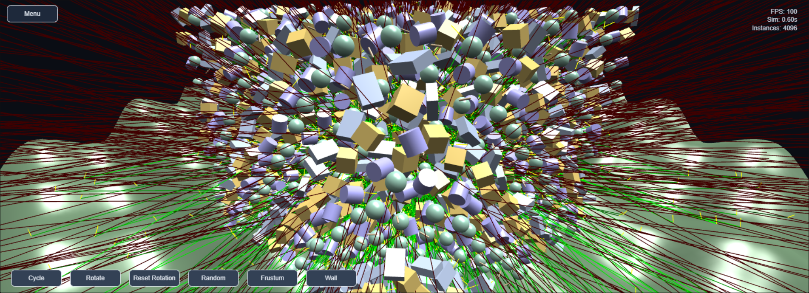

16384 rays per source (random / frustum / wall) are cast against a 16³ collidable cloud and drawn
as colored segments.

- **Physics (BepuPhysics2):** `Simulation.RayCast<THitHandler>` is the only overload in the
  package; `RayData` carries origin/direction/id, and the hit handler clamps the traversal by
  assigning `maximumT = t` by ref. Three sources cycle and the ray set rotates around Y. The
  upstream batched-vs-unbatched comparison is dropped (`SimulationRayBatcher<T>` has no public
  constructor and there is no text channel); a zero-radius capsule is rendered with a small baked
  radius, and convex hulls are drawn as unit boxes.
- **ECS (Bonobo.ECS):** render ids `0` deformed plane, `1000+` boxes, `10000+` capsules,
  `20000+` spheres, `30000+` cylinders, `40000+` hulls, `100000+` ray line segments. The buffer
  adds `MaxLineCount · LineStateStride` on top of the transforms (2 segments per hit, 1 per
  miss).
- **Render (Babylon.js v9):** five collidable shape sets plus one `LineSet` — a single
  fixed-capacity `LinesMesh` with per-vertex `Color4` (green shaded hits + yellow normals, dark
  red misses) that hides unused slots with alpha 0; GUI Cycle / Rotate / Reset Rotation /
  Random / Frustum / Wall.

### 22. Sweep (`sweep`)

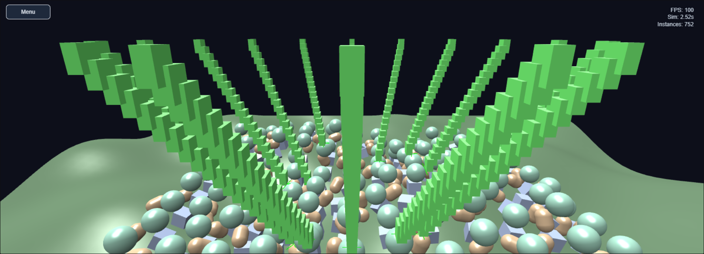

Sixteen box sweeps rotate around the scene, drawing 20-pose ghost trails and impact tangent
lines.

- **Physics (BepuPhysics2):** `Simulation.Sweep<TShape, TSweepHitHandler>` is the managed
  scene-wide path (`SweepTaskRegistry.Sweep(void*)` is unsafe-only and dropped). A 12×3×12 grid
  of boxes, capsules and spheres falls onto a deformed static plane; each sweep stores 20 ghost
  poses and, on impact, two tangent lines marking the contact plane.
- **ECS (Bonobo.ECS):** transform ids `0` plane, `100+` boxes, `10000+` capsules, `20000+`
  spheres, `1000+` hit ghosts, `2000+` miss ghosts; line ids `100000+`.
- **Render (Babylon.js v9):** shape sets for the grid and ghosts plus one `LineSet` for impact
  tangents; ghost trails are solid green (hit) / red (miss) per id range.

### 23. Contact Events (`contact-events`)


The full eight-event `IContactEventHandler` layer: every added contact spawns an aging particle.

- **Physics (BepuPhysics2):** `ContactEvents` turns narrow-phase manifold callbacks into
  add/remove/touching/pair events; a box and a capsule drop onto a floor and a wall, and every
  newly added contact spawns a particle that lives 0.7325 s. Particles are a fixed preallocated
  array (256) instead of the upstream growable `QuickList`; the `drop` verb re-triggers contacts.
- **ECS (Bonobo.ECS):** render ids `0` floor, `1` wall, `100` box, `101` capsule, `10000+`
  particles; particles are short-lived transform records emitted from the handler's array.
- **Render (Babylon.js v9):** shape sets for the statics, box, capsule and green particle
  spheres; a `Drop` button.

### 24. Collision Tracking (`collision-tracking`)

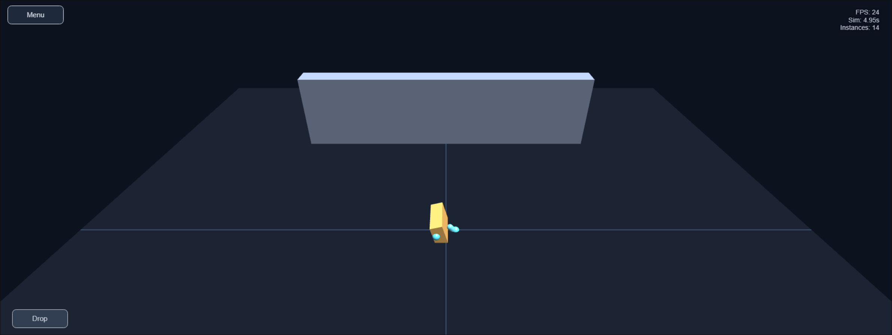

Narrow-phase manifold data is collected by `CollisionTracker` and analyzed after the timestep.

- **Physics (BepuPhysics2):** the tracker records current and previous pair state per body and
  reports new touching feature ids, matching the Contact Events add behavior without the event
  control flow. A box and a capsule drop onto a floor and a wall; the `drop` verb tears the
  bodies back up for a fresh burst.
- **ECS (Bonobo.ECS):** the same id layout as Contact Events (`0` floor, `1` wall, `100` box,
  `101` capsule, `10000+` particles).
- **Render (Babylon.js v9):** the same mesh layout with cyan particle spheres; a `Drop` button.

### 25. Collision Query (`collision-query`)

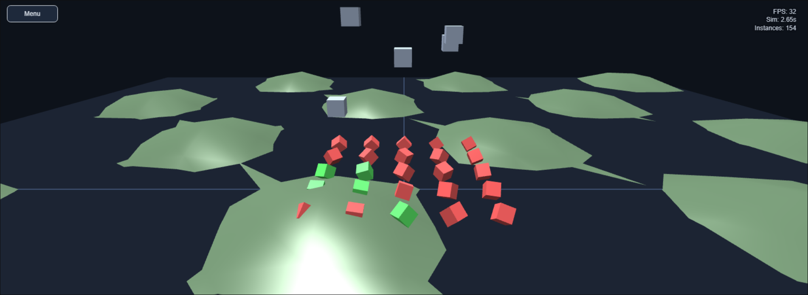

A 5×5 grid of shape queries against falling boxes through a `CollisionBatcher`; touched queries
turn green, untouched red.

- **Physics (BepuPhysics2):** a broad-phase overlap enumerator collects candidates, and every
  pair is handed to the managed `CollisionBatcher.Add(TypedIndex, TypedIndex, …)` overload; a
  query is "touched" when a manifold reports depth ≥ 0. Both shapes must be registered in
  `Simulation.Shapes`, and a fresh batcher is created per pass because a batcher cannot be
  reused across flushes once nonconvex shapes were added. 128 boxes fall through the query grid;
  a deformed static plane sits underneath.
- **ECS (Bonobo.ECS):** render ids `0` ground, `1` deformed plane, `100+` falling boxes,
  `1000+` touched queries, `2000+` untouched queries.
- **Render (Babylon.js v9):** box sets for the falling boxes and both query outcomes, plus a
  client-side deformed plane; no GUI commands (the probe runs every frame).

### 26. Solver Contact Enumeration (`solver-contact-enumeration`)

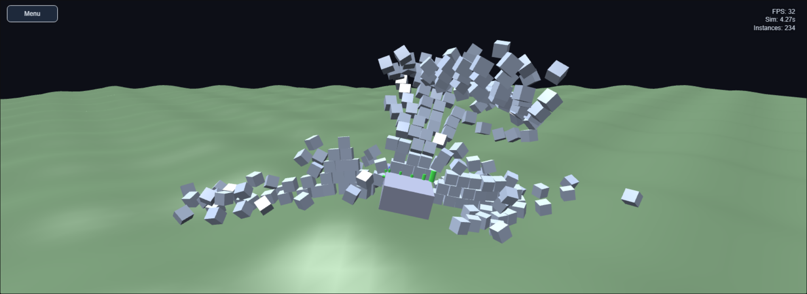

A 20-row pyramid drops onto a large sensor box; solver contacts are visualized as impulse-scaled
cylinders.

- **Physics (BepuPhysics2):** a 1:1 `ISolverContactDataExtractor` port pulls constraint data out
  of the solver into a simpler AOS representation
  (`NarrowPhase.TryExtractSolverContactData` + the sensor's
  `BodyReference.Constraints[i].ConnectingConstraintHandle`). Each visual cylinder's length
  follows the accumulated penetration impulse and its radius the friction impulse; touching
  contacts route to the green id range, speculative (negative-depth) contacts to the blue range.
- **ECS (Bonobo.ECS):** render ids `0` deformed plane, `1` sensor box, `100+` pyramid boxes,
  `1000+` green contact visuals, `2000+` blue speculative visuals (up to 1024 visuals).
- **Render (Babylon.js v9):** box sets for the sensor/pyramid and two cylinder sets whose
  scales animate per contact; a client-side deformed plane; no GUI commands.

### 27. Custom Voxel Collidable (`custom-voxel-collidable`)

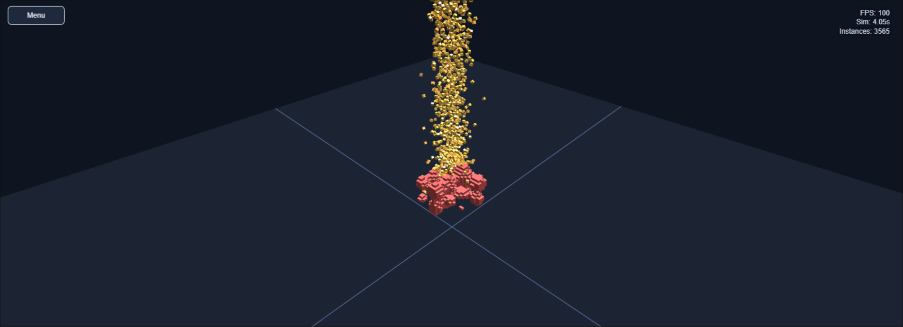

A custom homogeneous compound voxel terrain, with 1600 boxes raining onto it.

- **Physics (BepuPhysics2):** `Voxels : IHomogeneousCompoundShape<Box, BoxWide>` (type id 12) is
  a grid of `Box` children in an object-space `Tree` built with `Tree.SweepBuild` (the voxel
  scale is baked into the tree). The narrow phase learns the shape through eight convex/compound
  collision task registrations and eight sweep registrations; a leaf tester implements ray
  casts. Upstream 40×30×40 → 20×15×20 voxels and 4096 → 1600 boxes.
- **ECS (Bonobo.ECS):** render ids `0` static ground, `100+` falling boxes, `10000+` voxels; the
  voxel terrain is emitted as one transform record per voxel.
- **Render (Babylon.js v9):** a box shape set for the falling boxes and a large voxel box set
  for the terrain (thin instances keep it to two draw calls); no GUI commands.

### 28. Block Chain (`block-chain`)

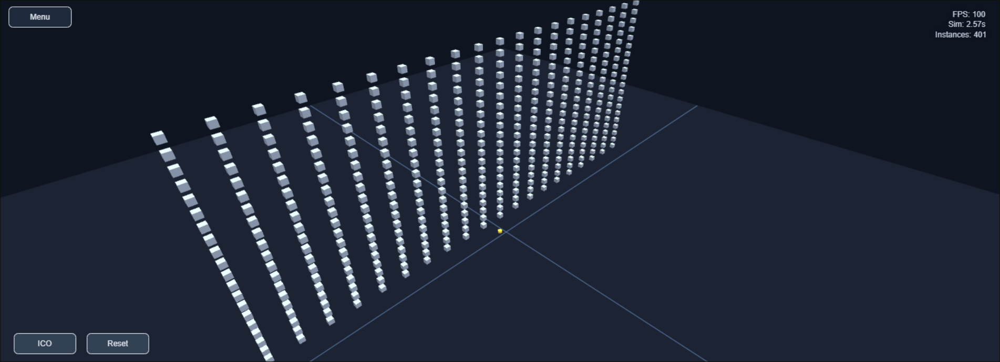

Twenty forks of twenty ball-socket-connected boxes, plus a "press Z for an ICO" coin fountain.

- **Physics (BepuPhysics2):** each chain hangs from a kinematic top block and is connected with
  `BallSocket` constraints. The upstream Z key is the `ico` verb: it spawns a batch of
  `Cylinder(1.5, 0.1)` coins, each ICO replacing the previous batch so the pinned signal buffer
  stays fixed-capacity.
- **ECS (Bonobo.ECS):** render ids `0` ground, `100+` blocks (fork-major order), `1000+` coins;
  `reset` also clears the coins.
- **Render (Babylon.js v9):** a box set for the blocks and a cylinder set for coins — the unit
  cylinder convention scales each coin record to `(2r, 2·halfLength, 2r)`; GUI `ICO` / `Reset`.

### 29. Sponsor (`sponsor`)

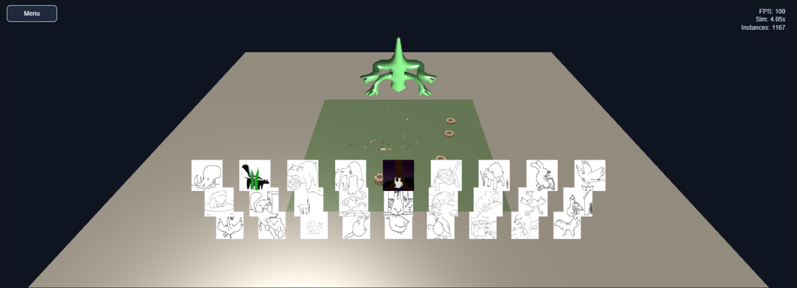

Hopping kinematic sponsor newts chase 150 AI characters through huts while a giant overlord newt
watches.

- **Physics (BepuPhysics2):** `SponsorNewt` is a kinematic body that hops between predetermined
  points with a parabolic height curve and one-frame pose-error velocity correction; the fleeing
  `SponsorCharacterAI` characters are dynamic character controllers (`CharacterControllers`),
  and an arena of walls keeps everyone in. Upstream 1000 AI characters → 150 and 30 hut rings →
  8; the overlord newt is a 60× static body.
- **ECS (Bonobo.ECS):** render ids `0` floor, `1..4` arena walls, `5` overlord newt, `10000+`
  hopping newts, `20000+` AI characters (capsules), `30000+` hut boxes.
- **Render (Babylon.js v9):** `newt.obj` meshes for the hopping newts and the overlord, capsule
  shape set for characters, box set for huts, and 27 sponsor PNG billboards
  (`Mesh.BILLBOARDMODE_ALL`) around the arena — billboards are presentation-only and never enter
  physics.

### 30. Simple Self Contained (`simple-self-contained`)

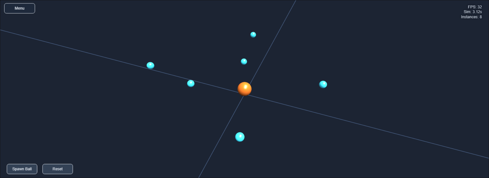

One dynamic sphere on a huge static box floor, plus ECS-only orbit markers — the canonical
minimal Bepu fixture.

- **Physics (BepuPhysics2):** the upstream `SimpleSelfContainedDemo` setup (sphere + static
  `Box(500, 1, 500)` floor, gravity only) with the deterministic null-dispatcher solve;
  click/tap fires a 30 m/s projectile sphere (`IFireBallSink`), and `spawn-ball` / `reset` verbs
  are exposed to the GUI.
- **ECS (Bonobo.ECS):** spheres are entities carrying `PhysicsBody` handles with mirrored poses;
  six orbit markers have **no** Bepu body at all — the generated `OrbitSystem` `[Query]` drives
  their positions each step, proving the ECS-authoritative path reaches the same render signal
  as the physics path. Render ids `0` floor, `100+` balls, `10000+` markers; buffer capacity is
  header + 71×stride.
- **Render (Babylon.js v9):** a grid-material floor box, unit-sphere ball and marker thin
  instance sets; tap-to-fire raycasts on the client and publishes a fire-ball ring packet (id 2)
  — never client-side physics; GUI `Spawn Ball` / `Reset`.

## Compatibility rules

- All render state crosses C# -> JS as pinned `Float64Array` memory (never JSON, never
  per-entity interop calls). `DemoEngine` mirrors the engine header (`8`, extended with the P2c
  `lineCount`/`lineStride` fields), the `Transform3DState` stride (`12`), the appended
  `LineState` stride (`12`) and the globals clock block (`8`) — pinned by unit tests.
- Physics is authoritative in C#: deterministic null-`ThreadDispatcher` solves.
- Presentation-only concerns (camera, GUI, shaders, terrain visuals, cloth display) are
  client-side and never feed simulation state back except through the input ring.
- Memory reset on scene switch: the Babylon scene (meshes, materials, GUI textures) is
  disposed, `SimulationHost.Connect` stops the previous sim and frees its pinned signal
  buffer's `GCHandle`, and the host drops the old WebView2 shared-buffer channels.
- AOT: no runtime reflection, no dynamic IL; ECS components register through
  `Bonobo.ECS.SourceGenerators` generated code.
